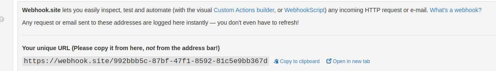

## Descrição
A API foi desenvolvida em TypeScript usando o framework NestJS e é executada em um sistema Ubuntu.

## Documentação 
A documentação do Swagger está disponível. Para acessá-la, basta executar a aplicação e abrir o seguinte endereço em qualquer navegador:

```bash
$ http://localhost:3000/docs
```

## Arquivo .env
O arquivo .env ja esta configurado como:

```bash
$ BHUT_URL=http://api-test.bhut.com.br:3000/api
$ WEBHOOK_URL=https://webhook.site/992bbb5c-87bf-47f1-8592-81c5e9bb367d
```

## WEB HOOK
Acesso ao site usado no sistema: [https://webhook.site/#!/992bbb5c-87bf-47f1-8592-81c5e9bb367d/f0fc6f1c-7480-4284-ba4c-eb584d8ee3c4/1](https://webhook.site/#!/992bbb5c-87bf-47f1-8592-81c5e9bb367d/f0fc6f1c-7480-4284-ba4c-eb584d8ee3c4/1)

Caso não funcione com essas chaves, acesse o site oficial do Web Hook: [https://webhook.site/](https://webhook.site/)



Edite o valor do parâmetro WEBHOOK_URL no arquivo .env com a URL única fornecida pelo site.

## Executando a API

## Executando com Docker
Para executar com o Docker, você deve ter o Docker e o Docker Compose instalados em seu notebook.

```bash
$ docker-compose up --build
```

Se o MongoDB falhar, execute o seguinte comando:
```bash
$ service mongod stop
```

Então, basta rodar novamente o comando do Docker.


## Executando com Node.js 
Para executar a API, você deve ter o Node.js, o npm e o MongoDB instalados em seu computador.

## Instalação
```bash
$ npm install
```

## Iniciar
```bash
$ npm run start
```

## Test
```bash
# unit tests
$ npm run test
```
